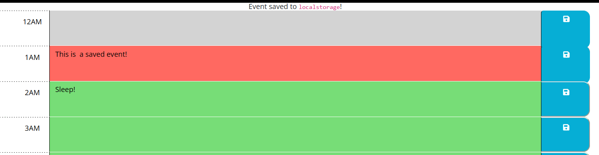

# Work Day Scheduler

# Description

A basic calendar app that will save and load data you input into the event fields. The page will dynamically update with if the times are in the past, present or future.
 
# Installation

Open the link in a modern browser (Tested on Firefox and Chrome): https://therandommer.github.io/Work-Day-Scheduler/

# Usage

When you open the site in your browser you should see a site that looks like the screenshot below:

Enter some text into the central portion of the site (coloured green, grey or red) and click the blue button to the right side to save your data to localstorage
## The Timetable

## License

Using MIT License.